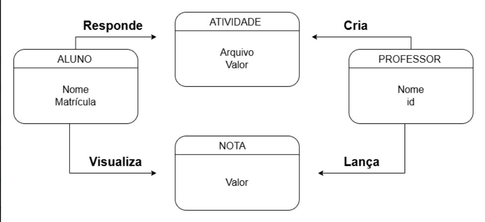

## Diagrama de Classes



# 🎓 Sistema de Faculdade

Projeto desenvolvido com o objetivo de aplicar conceitos de Engenharia de Software, incluindo levantamento de requisitos, modelagem e diagramação UML, além de uma implementação básica em Java.

---

## 📌 Funcionalidades

* Cadastro de alunos
* Cadastro de professores
* Lançamento de atividades
* Envio de atividades pelos alunos
* Lançamento de notas
* Visualização de boletim

---

## 🧠 Modelagem do Sistema

A modelagem foi baseada na definição das principais entidades do sistema:

* Aluno
* Professor
* Atividade
* Nota

Com seus respectivos atributos e relacionamentos.

---

## 💻 Tecnologias utilizadas

* Java
* Eclipse
* draw.io (diagrams.net)

---

## 📁 Estrutura do Projeto

```
sistema-faculdade/
 ├── requisitos.md
 ├── modelagem.md
 ├── diagramas/...
 └── src/
```

---

## 🚀 Objetivo

Este projeto foi desenvolvido para fins de estudo e para compor portfólio na área de Engenharia de Software.

---

## 👨‍💻 Autor

João Victor Bontorin
